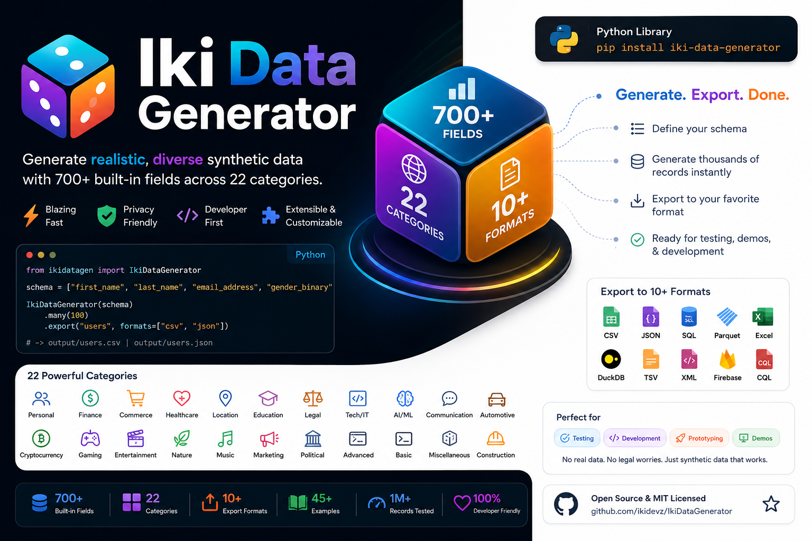

# 🎲 Iki Data Generator

> Generate realistic, diverse synthetic data with **729 built-in fields across 22 categories**. Perfect for testing, development, and prototyping — without the legal baggage of real data.

---



## What Is This?

**Iki Data Generator** is a Python library that creates synthetic datasets on demand. Instead of wrestling with dummy data or copy-pasting fake records, you define a _schema_ (which fields you want), call `.many(n)` to generate _n_ records, and export them to CSV, JSON, SQL, Excel, Parquet, or one of 14 total file formats. That's it.

It's built for developers who need:

- **Test data** for unit/integration tests
- **Demo data** for presentations or prototypes
- **Mock databases** for local development
- **Privacy-friendly datasets** with realistic properties but zero personal info
- **Performance testing** with large datasets

---

## Why Use Iki Data Generator?

### ✅ You Get

| Benefit                            | What It Means                                                                                                               |
| ---------------------------------- | --------------------------------------------------------------------------------------------------------------------------- |
| **729 Fields**                     | First name, email, credit card, medical codes, stock prices, cryptocurrency addresses, ML metrics, etc.                     |
| **22 Categories**                  | Personal, Finance, Commerce, Health, Location, Education, Legal, AI, Developer Tools, Blockchain, Telecom, Travel, and more |
| **Easy Schema**                    | Simple string shortcuts or full-control dicts, freely mixed in the same schema                                              |
| **Flexible Export**                | CSV, TSV, JSON, NDJSON, SQL, CQL, Firebase JSON, Excel, HTML, Pickle, XML, DBUnit XML, Parquet, DuckDB                      |
| **Zero Dependencies on Real Data** | No need to anonymize or worry about PII                                                                                     |
| **Reproducible**                   | Pass a `seed` and get the exact same dataset every run                                                                      |
| **Extensible**                     | Add your own providers as plain Python classes dropped into the `providers/` tree                                           |

### ❌ You Don't Get

- No real person's data
- No need for data anonymization lawyers
- No internet calls to fake APIs
- No massive CSV files to download and commit

---

## Installation

### From PyPI

```bash
pip install iki-data-generator
```

### From Source

```bash
git clone https://github.com/ikidevz/IkiDataGenerator.git
cd Iki-Data-Generator
pip install -e .
```

### Requirements

- **Python** ≥ 3.10
- **Dependencies** (installed automatically): `duckdb`, `pandas`, `pyarrow`, `numpy`, `openpyxl`, `python_bcrypt`, `python_dateutil`, `rstr`, `lorem_text`

---

## Quick Start (60 Seconds)

### The Simplest Example

```python
from ikidatagen import IkiDataGenerator

# Define what fields you want (plain string shorthand)
schema = ["first_name", "last_name", "email_address", "gender_binary"]

# Generate 100 records and export
IkiDataGenerator(schema).many(100).export("users")
```

**Result:** `output/users.csv` with 100 realistic user records (`export()` defaults to CSV only — pass `formats=[...]` for more).

### A More Realistic Example

```python
from ikidatagen import IkiDataGenerator

schema = [
    {
        "label": "User ID",
        "key_label": "row_number",
        "options": {"blank_percentage": 0},   # no blanks for the ID column
    },
    "first_name",
    "last_name",
    "email_address",
    {
        "label": "Account Created",
        "key_label": "current_timestamp",
        "options": {"blank_percentage": 5},   # 5% will be null
    },
    {
        "label": "IP Address",
        "key_label": "ip_address_v4",
        "options": {"blank_percentage": 25},  # 25% will be null
    },
    {
        "label": "Full Profile",
        "key_label": "template",
        "options": {
            "template": "{{first_name}} {{last_name}} ({{email_address}})"
        },
    },
]

# Generate 500 records and save to both CSV and JSON
IkiDataGenerator(schema).many(500).export("users", formats=["csv", "json"])
```

**Result:** `output/users.csv` and `output/users.json` with 500 complete user records, ready to use.

---

## Schema Definition

A schema is a `list` where each entry is **either a plain string or a dict**. You can freely mix both in the same schema.

### Shorthand — plain string

```python
"first_name"
```

Expands to `{"key_label": "first_name", "label": "first_name", "group": None, "options": {}}`. The output column is named after the field itself, and the provider's category (`group`) is auto-resolved from the internal registry.

### Full control — dict

```python
{
    "key_label": "salary_range",     # required — which provider to use
    "label": "Salary",               # optional — renames the output column (defaults to key_label)
    "group": "finance",              # optional — only needed to disambiguate a key_label that exists in more than one category
    "options": {"blank_percentage": 10},
}
```

`key_label` is the only required key. `label`, `group`, and `options` are all optional.

### Key Parameters (per-field `options`)

These options are handled by `BaseGenerator`/`BaseProvider` and work for **every** field, on top of whatever provider-specific options that field accepts (e.g. `template`, `min`, `max`, `from_date`):

| Option             | Type            | Description                                                                                                                           |
| ------------------ | --------------- | ------------------------------------------------------------------------------------------------------------------------------------- |
| `blank_percentage` | `float` (0–100) | Percentage of generated rows to leave as `None` for this field.                                                                       |
| `unique`           | `bool`          | Retry generation until the value is unique across the dataset for this field.                                                         |
| `max_unique_tries` | `int`           | Max retry attempts before raising when `unique=True` (default `1000`).                                                                |
| `choices`          | `list`          | Ignore the provider entirely and sample from this fixed list instead.                                                                 |
| `weights`          | `list`          | Optional weights matching `choices` for weighted random sampling.                                                                     |
| `mask`             | `bool`          | Replace the generated value with the literal string `"[REDACTED]"`.                                                                   |
| `noise`            | `bool`          | Randomly perturb a string value (character swap/repeat/drop/insert) — useful for dirty-data testing.                                  |
| `constraints`      | `dict`          | Post-process the value: `min_length`, `max_length`, `min_value`, `max_value`, `allowed_values`.                                       |
| `strict`           | `bool`          | Provider-level (default `True`). If `True`, unknown/misspelled options raise a `ValueError`; if `False`, they emit a warning instead. |

```python
schema = [
    {
        "key_label": "country",
        "options": {
            "choices": ["US", "CA", "MX"],
            "weights": [0.7, 0.2, 0.1],
        },
    },
    {
        "key_label": "email_address",
        "options": {"unique": True, "max_unique_tries": 5000},
    },
    {
        "key_label": "ssn",
        "options": {"mask": True},
    },
]
```

---

## Complete Provider Reference (729 fields)

Every `key_label` below can be used directly in a schema. Columns:

- **`key_label`** — the provider name to use in your schema.
- **Example Output** — an actual sample value generated by that provider (seeded, so it's reproducible), so you can see what the field produces without running it yourself.
- **Advanced Options** — field-specific options this provider accepts on top of the universal `blank_percentage` (every provider supports `blank_percentage`, so it isn't repeated per row — see [Key Parameters](#key-parameters-per-field-options)). Defaults are shown next to each option; `—` means the provider takes no extra options. Options marked `(required)` have no default and must be supplied.

Every provider also accepts the schema-level options handled by the generator itself: `unique`, `max_unique_tries`, `choices`, `weights`, `mask`, `noise`, `constraints`, `strict` (see [Key Parameters](#key-parameters-per-field-options)).

```python
schema = [
    {"key_label": "number", "options": {"blank_percentage": 5, "min": 1, "max": 100, "decimals": 2}},
    {
        "key_label": "datetime",
        "options": {
            "from_date": "2020-01-01",
            "to_date": "2024-12-31",
            "date_format": "ISO 8601 (UTC)",
        },
    },
]
```

The datetime provider accepts common bound formats for `from_date` and `to_date`, including ISO strings (`YYYY-MM-DD`), slash-separated values (`MM/DD/YYYY`), dashed values (`DD-MM-YYYY`), dotted values (`DD.MM.YYYY`), and month-name strings. The `date_format` option also accepts common aliases like `YYYY-MM-DD`, `DD/MM/YYYY`, `DD-MM-YYYY`, `SQL datetime`, and `ISO 8601 (UTC)`.

### 🧑 Personal — `personal` (65 providers)

| `key_label`            | Example Output                                                  | Advanced Options |
| ---------------------- | --------------------------------------------------------------- | ---------------- |
| `age_group`            | `'13-17'`                                                       | —                |
| `business_type`        | `'Mutual Organization'`                                         | —                |
| `buzzword`             | `'e-business'`                                                  | —                |
| `catch_praise`         | `'Sharable bifurcated algorithm'`                               | —                |
| `company_name`         | `'America Movil'`                                               | —                |
| `conference_name`      | `'Oracle OpenWorld'`                                            | —                |
| `daily_habit`          | `'Self-Reflection'`                                             | —                |
| `degree`               | `'Doctor of Education [EdD]'`                                   | —                |
| `department_corporate` | `'Customer Service'`                                            | —                |
| `dream_job`            | `'Retail Account Representative'`                               | —                |
| `duns_number`          | `'10-433-2181'`                                                 | —                |
| `education_level`      | `'Technical Certification'`                                     | —                |
| `ein`                  | `'10-4332181'`                                                  | —                |
| `employment_status`    | `'Apprentice'`                                                  | —                |
| `event_type`           | `'Festival'`                                                    | —                |
| `fake_company_name`    | `'York, York and York'`                                         | —                |
| `first_name`           | `'Gregory'`                                                     | —                |
| `first_name_female`    | `'Johanna'`                                                     | —                |
| `first_name_male`      | `'Nemesio'`                                                     | —                |
| `full_name`            | `'Gregory York'`                                                | —                |
| `gender`               | `'Bigender'`                                                    | —                |
| `gender_abbrev`        | `'M'`                                                           | —                |
| `gender_binary`        | `'Male'`                                                        | —                |
| `gender_facebook`      | `'Trans* Woman'`                                                | —                |
| `hair_color`           | `'Brown'`                                                       | —                |
| `hashtag`              | `'#voltages'`                                                   | —                |
| `hobby`                | `'Reading'`                                                     | —                |
| `income_level`         | `'Very High'`                                                   | —                |
| `industry`             | `'Education'`                                                   | —                |
| `interview_stage`      | `'Final Round'`                                                 | —                |
| `job_title`            | `'Retail Account Representative'`                               | —                |
| `language`             | `'Turkish'`                                                     | —                |
| `language_code`        | `'tr'`                                                          | —                |
| `last_name`            | `'Richardson'`                                                  | —                |
| `legal_entity`         | `'Partnership'`                                                 | —                |
| `life_stage`           | `'Middle-aged'`                                                 | —                |
| `linkedin_skill`       | `'Retail Account Representative'`                               | —                |
| `marital_status`       | `'Engaged'`                                                     | —                |
| `military_rank`        | `'General'`                                                     | —                |
| `mood`                 | `'Relaxed'`                                                     | —                |
| `nationality`          | `'Réunionese'`                                                  | —                |
| `occupation`           | `'Retail Account Representative'`                               | —                |
| `organization_type`    | `'NGO'`                                                         | —                |
| `performance_rating`   | `'Exceeds Expectations'`                                        | —                |
| `personality_trait`    | `'Extrovert'`                                                   | —                |
| `pet_name`             | `'Gregory'`                                                     | —                |
| `pet_type`             | `'Cat'`                                                         | —                |
| `project_status`       | `'Canceled'`                                                    | —                |
| `pronoun`              | `'he/him'`                                                      | —                |
| `quote`                | `"The single most important thing in a child's performance...'` | —                |
| `race`                 | `'Sri Lankan'`                                                  | —                |
| `reaction`             | `'Thanks'`                                                      | —                |
| `relationship_type`    | `'Teammate'`                                                    | —                |
| `religion`             | `'Paganism'`                                                    | —                |
| `role`                 | `'Viewer'`                                                      | —                |
| `salary_range`         | `'$20,000 - $30,000'`                                           | —                |
| `shirt_size`           | `'XXL'`                                                         | —                |
| `shoe_size`            | `'6.5'`                                                         | `type='US'`      |
| `slogan`               | `'MILO Everyday!'`                                              | —                |
| `ssn`                  | `'655-15-0410'`                                                 | —                |
| `suffix`               | `'V'`                                                           | —                |
| `team_name`            | `'Operations Team'`                                             | —                |
| `title`                | `'Amb.'`                                                        | —                |
| `university`           | `'Nanjing University'`                                          | —                |
| `zodiac_sign`          | `'Aquarius'`                                                    | —                |

### 🛍️ Commerce — `commerce` (62 providers)

| `key_label`                    | Example Output                                      | Advanced Options                    |
| ------------------------------ | --------------------------------------------------- | ----------------------------------- |
| `barcode_ean13`                | `'1043321819600'`                                   | —                                   |
| `barcode_upc`                  | `'104332181960'`                                    | —                                   |
| `bban`                         | `'6022768040250165'`                                | `country='US'`                      |
| `bundle_type`                  | `'Starter Pack'`                                    | —                                   |
| `click_depth`                  | `1`                                                 | —                                   |
| `coffee_type`                  | `'Iced Coffee'`                                     | —                                   |
| `coupon_code`                  | `'INTRO19'`                                         | —                                   |
| `credit_card_number`           | `'30104332181969'`                                  | —                                   |
| `credit_card_type`             | `'Diners Club'`                                     | —                                   |
| `currency`                     | `'$'`                                               | —                                   |
| `currency_code`                | `'AUD'`                                             | —                                   |
| `currency_symbol`              | `'$'`                                               | —                                   |
| `customer_feedback_score`      | `6`                                                 | —                                   |
| `delivery_route_code`          | `'RT-760'`                                          | —                                   |
| `delivery_status`              | `'Failed Attempt'`                                  | —                                   |
| `delivery_time_window`         | `'5PM-7PM'`                                         | —                                   |
| `department_retail`            | `'Curtains & Blinds'`                               | —                                   |
| `discount_percentage`          | `'62%'`                                             | —                                   |
| `fabric_type`                  | `'Cashmere'`                                        | —                                   |
| `freight_mode`                 | `'Freight Forwarding'`                              | —                                   |
| `furniture_type`               | `'Recliner'`                                        | —                                   |
| `gem_stone`                    | `'Jade'`                                            | —                                   |
| `iban`                         | `'SE26 AHFT 6804 0250 1652 5808'`                   | `continent=None`                    |
| `ingredient`                   | `'Eggs'`                                            | —                                   |
| `inventory_status`             | `'Coming Soon'`                                     | —                                   |
| `invoice_number`               | `'INV-026226'`                                      | —                                   |
| `loyalty_tier`                 | `'Silver'`                                          | —                                   |
| `meal_type`                    | `'Late-night Meal'`                                 | —                                   |
| `membership_level`             | `'Basic'`                                           | —                                   |
| `money`                        | `'$639.43'`                                         | `min=0`, `max=1000`, `currency='$'` |
| `office_supply`                | `'Binder'`                                          | —                                   |
| `order_status`                 | `'Awaiting Shipment'`                               | —                                   |
| `package_weight`               | `'1.2 ton'`                                         | —                                   |
| `payment_method`               | `'American Express'`                                | —                                   |
| `payment_status`               | `'Pending'`                                         | —                                   |
| `postal_service`               | `'China Post'`                                      | —                                   |
| `price_sensitivity_level`      | `'Very High'`                                       | —                                   |
| `product_category`             | `' Sports and Outdoor Equipment'`                   | —                                   |
| `product_description`          | `'Classic snack'`                                   | —                                   |
| `product_name`                 | `'GoSports BattleChip Backyard Golf Cornhole Game'` | —                                   |
| `product_price`                | `'$699.23'`                                         | —                                   |
| `product_subcategory`          | `'Technology'`                                      | —                                   |
| `promo_expiry_date`            | `'12/09/2028'`                                      | —                                   |
| `recipe_name`                  | `'Mango Float'`                                     | —                                   |
| `recommendation_slot_position` | `'Notification Bar'`                                | —                                   |
| `restaurant_type`              | `'Vietnamese'`                                      | —                                   |
| `return_reason`                | `'Voucher Not Applied'`                             | —                                   |
| `review_text`                  | `'Not worth the price'`                             | —                                   |
| `sales_channel`                | `'Retail'`                                          | —                                   |
| `shipment_status`              | `'Failed Attempt'`                                  | —                                   |
| `shipping_method`              | `'Priority Shipping'`                               | —                                   |
| `sku`                          | `'SKU-117-AH'`                                      | —                                   |
| `stock_industry`               | `'Insurance'`                                       | —                                   |
| `stock_market`                 | `'Tokyo Stock Exchange [TSE]'`                      | —                                   |
| `stock_market_cap`             | `'$26.18B'`                                         | —                                   |
| `stock_name`                   | `'Monolithic Power Systems'`                        | —                                   |
| `stock_sector`                 | `'Semiconductors'`                                  | —                                   |
| `stock_symbol`                 | `'MPWR'`                                            | —                                   |
| `subscription_plan`            | `'Plus'`                                            | —                                   |
| `tracking_number`              | `'FDX-72117550'`                                    | —                                   |
| `warranty_period`              | `'90 Days'`                                         | —                                   |
| `water_type`                   | `'Spring'`                                          | —                                   |

### 💻 Developer Tools — `developer_tools` (104 providers)

| `key_label`                   | Example Output                                                  | Advanced Options                                     |
| ----------------------------- | --------------------------------------------------------------- | ---------------------------------------------------- |
| `api_endpoint_path`           | `'/api/v1/tags'`                                                | —                                                    |
| `api_key`                     | `'auth_hbVrpoiVgRV5IfLBcbfnoGMbJmTPSIAoCLrZ3aWZkSBvrjn9'`       | `prefix=None`                                        |
| `api_version`                 | `'v2.4'`                                                        | —                                                    |
| `app_bundle_id`               | `'gov.fda.Mat Lam Tam'`                                         | —                                                    |
| `app_name`                    | `'Bamity'`                                                      | —                                                    |
| `app_store_category`          | `'Home-5G'`                                                     | —                                                    |
| `app_version`                 | `'0.43'`                                                        | —                                                    |
| `automation_action`           | `'Close Curtains'`                                              | —                                                    |
| `automation_trigger`          | `'Sunset'`                                                      | —                                                    |
| `base64_image`                | `'data:image/jxl;base64,zwCjspVIvoMOs4cSB3CI16U0M5SXCuE49a...'` | —                                                    |
| `battery_level`               | `'82%'`                                                         | —                                                    |
| `browser`                     | `'Tor Browser 13.0.4'`                                          | —                                                    |
| `churn_risk_score`            | `0.64`                                                          | —                                                    |
| `cloud_provider`              | `'Render'`                                                      | —                                                    |
| `cloud_storage`               | `'Linode Object Storage'`                                       | —                                                    |
| `container_id`                | `'qahfU7680403'`                                                | —                                                    |
| `cookie_name`                 | `'newsletter_subscribed'`                                       | —                                                    |
| `css_class_name`              | `'.col-1'`                                                      | —                                                    |
| `css_color_name`              | `'darkmagenta'`                                                 | —                                                    |
| `data_center`                 | `'US-WEST-1'`                                                   | —                                                    |
| `database_type`               | `'Amazon Aurora'`                                               | —                                                    |
| `device_location`             | `'Kitchen'`                                                     | —                                                    |
| `dns_record_type`             | `'AAAA'`                                                        | —                                                    |
| `docker_image`                | `'telegraf'`                                                    | —                                                    |
| `document_type`               | `'Purchase Order'`                                              | —                                                    |
| `dummy_image_url`             | `'http://dummyimage.com/214x125.png/010203/000000'`             | `min_w=100`, `min_h=100`, `max_w=1000`, `max_h=1000` |
| `electrical_component`        | `'Fuse'`                                                        | —                                                    |
| `email_address`               | `'Bonnie@mail.web.de'`                                          | —                                                    |
| `encryption_algorithm`        | `'RSA'`                                                         | —                                                    |
| `energy_mode`                 | `'Sustainability Mode'`                                         | —                                                    |
| `engagement_level`            | `'Occasional'`                                                  | —                                                    |
| `error_message`               | `'Driver initialization error'`                                 | —                                                    |
| `feature_usage_event`         | `'Report Exported'`                                             | —                                                    |
| `file_extension`              | `'.sys'`                                                        | —                                                    |
| `file_name`                   | `'wayne.armstrong.sys'`                                         | —                                                    |
| `file_size`                   | `'25108.23 B'`                                                  | —                                                    |
| `fingerprint_id`              | `'FP03279'`                                                     | —                                                    |
| `firmware_build`              | `'FW-2025.08.02-2824'`                                          | —                                                    |
| `firmware_version`            | `'0.4.7'`                                                       | —                                                    |
| `font_family`                 | `'Gantari'`                                                     | —                                                    |
| `form_factor`                 | `'Smartphone'`                                                  | —                                                    |
| `framework`                   | `'Tornado'`                                                     | —                                                    |
| `git_commit_hash`             | `'a043bae'`                                                     | `short=True`                                         |
| `hardware_type`               | `'Motherboard'`                                                 | —                                                    |
| `http_method`                 | `'OPTIONS'`                                                     | —                                                    |
| `http_status_code`            | `417`                                                           | —                                                    |
| `incident_type`               | `'Application Bug'`                                             | —                                                    |
| `iot_device_type`             | `'Wearable ECG Patch'`                                          | —                                                    |
| `ip_address_v4`               | `'163.177.121.157'`                                             | —                                                    |
| `ip_address_v4_cidr`          | `'163.177.121.157/8'`                                           | —                                                    |
| `ip_address_v6`               | `'bdd6:40fb:667:1ad1:1c80:317f:a3b1:799d'`                      | —                                                    |
| `ip_address_v6_cidr`          | `'bdd6:40fb:667:1ad1:1c80:317f:a3b1:799d/48'`                   | —                                                    |
| `json_web_token`              | `'ObroVR5f.BbnGbmPIoLZaZSvj.9vfg2MZUI-yJ1N3KTcosfogrOxxnr7PM'`  | —                                                    |
| `keyboard_layout`             | `'AZERTY'`                                                      | —                                                    |
| `laptop_brand`                | `'VAIO'`                                                        | —                                                    |
| `license_type`                | `'MIT'`                                                         | —                                                    |
| `log_level`                   | `'SUCCESS'`                                                     | —                                                    |
| `mac_address`                 | `'39:0C:8C:7D:72:47'`                                           | —                                                    |
| `md5`                         | `'0e135f9a84077741f2dc14bbd919ad28'`                            | —                                                    |
| `memory_size`                 | `'4GB'`                                                         | —                                                    |
| `microservice_name`           | `'order-service'`                                               | —                                                    |
| `mime_type`                   | `'audio/basic'`                                                 | —                                                    |
| `network_protocol`            | `'Telnet'`                                                      | —                                                    |
| `notification_type`           | `'SMS'`                                                         | —                                                    |
| `operating_system`            | `'Solaris'`                                                     | —                                                    |
| `package_manager`             | `'choco'`                                                       | —                                                    |
| `password_strength`           | `'Weak'`                                                        | —                                                    |
| `permission_level`            | `'Write'`                                                       | —                                                    |
| `port_number`                 | `11211`                                                         | —                                                    |
| `power_source`                | `'DC'`                                                          | —                                                    |
| `power_state`                 | `'Charging'`                                                    | —                                                    |
| `printer_type`                | `'All-in-One'`                                                  | —                                                    |
| `programming_language`        | `'ColdFusion'`                                                  | —                                                    |
| `protocol_version`            | `'IPv6'`                                                        | —                                                    |
| `resolution`                  | `'1366x768'`                                                    | —                                                    |
| `response_time`               | `'35ms'`                                                        | —                                                    |
| `screen_size`                 | `'14"'`                                                         | —                                                    |
| `security_question`           | `'What was your first concert?'`                                | —                                                    |
| `sensor_reading`              | `'127.89'`                                                      | —                                                    |
| `sensor_type`                 | `'Light Level'`                                                 | —                                                    |
| `server_name`                 | `'db-prod-01'`                                                  | —                                                    |
| `sha1`                        | `'cb84b588591f028862121131c2c10873c4ae563e'`                    | `length=16`                                          |
| `sha256`                      | `'8b2d8bdbe7e4ec8bc1f0fd170ffaadf7a8416a32f2c036955af5fc51...'` | `length=16`                                          |
| `slack_channel`               | `'#voltages'`                                                   | —                                                    |
| `smart_device_brand`          | `'Amazon Echo'`                                                 | —                                                    |
| `smart_device_type`           | `'Video Doorbell'`                                              | —                                                    |
| `social_media_platform`       | `'LinkedIn'`                                                    | —                                                    |
| `software_framework`          | `'TensorFlow'`                                                  | —                                                    |
| `software_license`            | `'Creative Commons'`                                            | —                                                    |
| `storage_type`                | `'External SSD'`                                                | —                                                    |
| `subject_line`                | `'Appointment Confirmation'`                                    | —                                                    |
| `subscription_renewal_status` | `'Auto-renew'`                                                  | —                                                    |
| `technology_stack`            | `'MEAN'`                                                        | —                                                    |
| `ticket_priority`             | `'Blocker'`                                                     | —                                                    |
| `top_level_domain`            | `'.mil'`                                                        | —                                                    |
| `uptime_percentage`           | `'97.5%'`                                                       | —                                                    |
| `user_agent`                  | `'Mozilla/5.0 (Macintosh; Intel Mac OS X 13_4_1) AppleWebK...'` | —                                                    |
| `user_cohort`                 | `'2026-Q1'`                                                     | —                                                    |
| `username`                    | `'meredith-diaz'`                                               | —                                                    |
| `uuid_v1`                     | `'64fdbe6b-8a1e-11f1-8196-c5846cafb4a6'`                        | —                                                    |
| `uuid_v4`                     | `'903bd11b-71d6-434f-b8c8-e617b819c124'`                        | —                                                    |
| `verification_code`           | `'602276'`                                                      | `length=6`                                           |
| `version_number`              | `'2023.01.24'`                                                  | `version_format='auto'`                              |
| `wifi_ssid`                   | `'Home-5G'`                                                     | —                                                    |

### 🏥 Health — `health` (67 providers)

| `key_label`               | Example Output                                                  | Advanced Options |
| ------------------------- | --------------------------------------------------------------- | ---------------- |
| `allergy`                 | `'Mold'`                                                        | —                |
| `allergy_flag`            | `'Yes'`                                                         | —                |
| `appointment_status`      | `'Lab Work Required Before Visit'`                              | —                |
| `blood_pressure_category` | `'Morning Surge Hypertension'`                                  | —                |
| `blood_pressure_reading`  | `'104/60'`                                                      | —                |
| `blood_type`              | `'A-'`                                                          | —                |
| `body_part`               | `'Knee'`                                                        | —                |
| `calorie_count`           | `'643 cal'`                                                     | —                |
| `chromosome`              | `'Chromosome 21'`                                               | —                |
| `diet_type`               | `'Soft Diet [Post-Surgery]'`                                    | —                |
| `dietary_restriction`     | `'Low-FODMAP'`                                                  | —                |
| `disability_type`         | `'Tourette Syndrome'`                                           | —                |
| `disease_name`            | `'Cancer'`                                                      | —                |
| `drug_company`            | `'UNICHEM'`                                                     | —                |
| `drug_name_brand`         | `'BUSPIRONE HYDROCHLORIDE'`                                     | —                |
| `drug_name_generic`       | `'BUSPIRONE'`                                                   | —                |
| `emergency_type`          | `'Evacuation Alert'`                                            | —                |
| `exercise_type`           | `'Zumba'`                                                       | —                |
| `fda_ndc_code`            | `'04332-181'`                                                   | —                |
| `food_allergy`            | `'Mold'`                                                        | —                |
| `hcpcs_code`              | `'E0981'`                                                       | —                |
| `hcpcs_name`              | `'Wheelchair accessory, seat upholstery, replacement only,...'` | —                |
| `health_insurance_plan`   | `'Medicare'`                                                    | —                |
| `heart_rate`              | `'146 bpm'`                                                     | —                |
| `hormone`                 | `'Thyroid-Stimulating Hormone [TSH]'`                           | —                |
| `hospital_city`           | `'OWENSBORO'`                                                   | —                |
| `hospital_department`     | `'Anesthesiology'`                                              | —                |
| `hospital_name`           | `'NORTHSTAR ANESTHESIA'`                                        | —                |
| `hospital_npi`            | `'1710352570'`                                                  | —                |
| `hospital_postal_code`    | `'423039811'`                                                   | —                |
| `hospital_state`          | `'KY'`                                                          | —                |
| `hospital_street_address` | `'1201 PLEASANT VALLEY RD'`                                     | —                |
| `icd10_diagnosis_code`    | `'T8169XS'`                                                     | —                |
| `icd10_dx_desc_long`      | `'Other acute reaction to foreign substance accidentally l...'` | —                |
| `icd10_dx_desc_short`     | `'Oth acute reaction to foreign sub acc left dur proc, seq...'` | —                |
| `icd10_proc_desc_long`    | `'Occlusion of Right Internal Jugular Vein, Open Approach'`     | —                |
| `icd10_proc_desc_short`   | `'Occlusion of Right Internal Jugular Vein, Open Approach'`     | —                |
| `icd10_procedure_code`    | `'05LM0ZZ'`                                                     | —                |
| `icd9_diagnosis_code`     | `'8509'`                                                        | —                |
| `icd9_dx_desc_long`       | `'Concussion, unspecified'`                                     | —                |
| `icd9_dx_desc_short`      | `'Concussion NOS'`                                              | —                |
| `icd9_proc_desc_long`     | `'Closed reduction of dislocation of shoulder'`                 | —                |
| `icd9_proc_desc_short`    | `'Cl reduc disloc-shoulder'`                                    | —                |
| `icd9_procedure_code`     | `'7971'`                                                        | —                |
| `lab_result_value`        | `'8.5'`                                                         | —                |
| `lab_test`                | `'EEG'`                                                         | —                |
| `lab_test_type`           | `'Thyroid Panel [TSH/T3/T4]'`                                   | —                |
| `macro_nutrient`          | `'Monounsaturated Fat'`                                         | —                |
| `meal_rating`             | `'3.6'`                                                         | —                |
| `medical_device_id`       | `'SURG-24592'`                                                  | —                |
| `medical_specialty`       | `'Nephrology'`                                                  | —                |
| `medicare_beneficiary_id` | `'2A43-J21-WD9R'`                                               | —                |
| `medication_dosage`       | `'5ml syrup'`                                                   | —                |
| `mental_health_condition` | `'Borderline Personality Disorder'`                             | —                |
| `nhs_number`              | `'104 332 1802'`                                                | —                |
| `nutrient`                | `'Vitamin B9 [Folate]'`                                         | —                |
| `organ`                   | `'Stomach'`                                                     | —                |
| `pain_level`              | `6`                                                             | —                |
| `pharmacy_name`           | `'Safeway Pharmacy'`                                            | —                |
| `prescription_id`         | `'MED126225'`                                                   | —                |
| `serving_size`            | `'3 cups'`                                                      | —                |
| `symptom`                 | `'Loss of Taste'`                                               | —                |
| `triage_level`            | `'Medium'`                                                      | —                |
| `vaccination_status`      | `'Not Vaccinated'`                                              | —                |
| `vaccination_type`        | `'Cholera Vaccine'`                                             | —                |
| `vitamin_name`            | `'Vitamin D3'`                                                  | —                |
| `workout_duration`        | `'2 hour'`                                                      | —                |

### ✨ Basic / Utility — `basic` (47 providers)

| `key_label`                | Example Output                                                  | Advanced Options                                                                                                                                                                                                                        |
| -------------------------- | --------------------------------------------------------------- | --------------------------------------------------------------------------------------------------------------------------------------------------------------------------------------------------------------------------------------- |
| `address_line_2`           | `'Room 52'`                                                     | —                                                                                                                                                                                                                                       |
| `binomial_distribution`    | `5`                                                             | `trials=10`, `probability=0.5`                                                                                                                                                                                                          |
| `blank`                    | `None`                                                          | —                                                                                                                                                                                                                                       |
| `boolean`                  | `True`                                                          | —                                                                                                                                                                                                                                       |
| `color`                    | `'Rich black (FOGRA39)'`                                        | —                                                                                                                                                                                                                                       |
| `current_timestamp`        | `'2026-07-28 00:50:52'`                                         | `format='%Y-%m-%d %H:%M:%S'`                                                                                                                                                                                                            |
| `custom_list`              | `'C'`                                                           | `values=None`                                                                                                                                                                                                                           |
| `datetime`                 | `'07/07/2013'`                                                  | `from_date=None`, `to_date=None`, `date_format='mm/dd/yyyy'`, `minimum_age=None`, `maximum_age=None` (supports ISO, slash, dash, dot, month-name, and common aliases like `YYYY-MM-DD`, `DD/MM/YYYY`, `SQL datetime`, `ISO 8601 (UTC)`) |
| `day_of_week`              | `'Saturday'`                                                    | —                                                                                                                                                                                                                                       |
| `dice_roll`                | `6`                                                             | —                                                                                                                                                                                                                                       |
| `dimension`                | `'3197.5x126.0'`                                                | `type='2D'`                                                                                                                                                                                                                             |
| `duration`                 | `'57 seconds'`                                                  | —                                                                                                                                                                                                                                       |
| `emoji`                    | `'📬'`                                                          | —                                                                                                                                                                                                                                       |
| `encrypt`                  | `'30877432d1026706d7e805da846a32c3bb81e3c29b62179273c8eb5b...'` | —                                                                                                                                                                                                                                       |
| `exponential_distribution` | `1.1973453573638597`                                            | `lam=1.0`                                                                                                                                                                                                                               |
| `frequency`                | `'Occasionally'`                                                | —                                                                                                                                                                                                                                       |
| `geometric_distribution`   | `1`                                                             | `probability=0.5`                                                                                                                                                                                                                       |
| `height`                   | `'160.0 mm'`                                                    | —                                                                                                                                                                                                                                       |
| `hex_color`                | `'#010203'`                                                     | —                                                                                                                                                                                                                                       |
| `imperial_unit`            | `'mile'`                                                        | —                                                                                                                                                                                                                                       |
| `isbn`                     | `'0-433-21819-3'`                                               | —                                                                                                                                                                                                                                       |
| `metric_prefix`            | `'femto'`                                                       | —                                                                                                                                                                                                                                       |
| `mongodb_object_id`        | `'6a67fceea043bae1606ff151'`                                    | —                                                                                                                                                                                                                                       |
| `month`                    | `'November'`                                                    | —                                                                                                                                                                                                                                       |
| `nato_phonetic`            | `'Uniform'`                                                     | —                                                                                                                                                                                                                                       |
| `normal_distribution`      | `0.18`                                                          | `mean=0.0`, `std_dev=1.0`, `decimals=2`                                                                                                                                                                                                 |
| `number`                   | `639`                                                           | `min=0`, `max=1000`, `decimals=0`, `values=None`                                                                                                                                                                                        |
| `paper_size`               | `'4x6'`                                                         | —                                                                                                                                                                                                                                       |
| `paragraphs`               | `'Voluptatum inventore ex magnam fugiat ab cupiditate earu...'` | `min_paragraph=1`, `max_paragraph=10`                                                                                                                                                                                                   |
| `password`                 | `'^2#a6hQ]'`                                                    | `min_length=8`, `upper_num=1`, `lower_num=1`, `numbers_num=1`, `symbols_num=1`                                                                                                                                                          |
| `password_hash`            | `'$2b$04$Vfo89b6.4Xx61SwGUDs2EuiD3LMP8iWDfRYEwTQdCcCpRHqPu...'` | `min_length=8`, `max_length=16`, `rounds=4`, `fast=False`                                                                                                                                                                               |
| `poisson_distribution`     | `0`                                                             | `mean=0.0`                                                                                                                                                                                                                              |
| `priority_level`           | `'Low'`                                                         | —                                                                                                                                                                                                                                       |
| `punctuation`              | `'Interrobang'`                                                 | —                                                                                                                                                                                                                                       |
| `rating`                   | `3.6`                                                           | —                                                                                                                                                                                                                                       |
| `row_number`               | `1`                                                             | —                                                                                                                                                                                                                                       |
| `season`                   | `'Midwinter'`                                                   | —                                                                                                                                                                                                                                       |
| `sentences`                | `'"Corrupti nobis magni qui dolorem, ducimus recusandae co...'` | `min_sentence=1`, `max_sentence=10`                                                                                                                                                                                                     |
| `sentiment`                | `'Positive'`                                                    | —                                                                                                                                                                                                                                       |
| `sequence`                 | `1`                                                             | `start_at=1`, `step=1`, `repeat=1`, `restart_at=None`                                                                                                                                                                                   |
| `short_hex_color`          | `'#010'`                                                        | —                                                                                                                                                                                                                                       |
| `temperature`              | `'21.6°C'`                                                      | `type='celsius'`                                                                                                                                                                                                                        |
| `time`                     | `'23:16'`                                                       | `time_from='00:00'`, `time_to='23:59'`, `fmt='24 Hour'`                                                                                                                                                                                 |
| `ulid`                     | `'01KYK383MKNKYD008A5AVVG594'`                                  | —                                                                                                                                                                                                                                       |
| `weather_condition`        | `'Freezing Rain'`                                               | —                                                                                                                                                                                                                                       |
| `weight`                   | `'557.5 gram'`                                                  | —                                                                                                                                                                                                                                       |
| `words`                    | `'voltages'`                                                    | —                                                                                                                                                                                                                                       |

### 📣 Marketing — `marketing` (43 providers)

| `key_label`                       | Example Output                                      | Advanced Options          |
| --------------------------------- | --------------------------------------------------- | ------------------------- |
| `ad_click_count`                  | `40`                                                | —                         |
| `ad_impression_count`             | `'214'`                                             | —                         |
| `average_order_value`             | `'$6397.87'`                                        | —                         |
| `browsing_duration`               | `'20h'`                                             | —                         |
| `campaign_name`                   | `'Limited Time Offer'`                              | —                         |
| `cart_abandonment_status`         | `'Recovered via Reminder'`                          | —                         |
| `channel_source`                  | `'TikTok Shop Integration'`                         | —                         |
| `churn_risk`                      | `'Recently Re-Engaged'`                             | —                         |
| `click_through_rate`              | `'31.97%'`                                          | —                         |
| `conversion_status`               | `'Converted via Promo'`                             | —                         |
| `conversion_value`                | `'$138.24'`                                         | —                         |
| `coupon_usage_status`             | `'Redeemed'`                                        | —                         |
| `cross_sell_opportunity`          | `'Low'`                                             | —                         |
| `customer_feedback_rating`        | `5`                                                 | —                         |
| `customer_lifetime_value`         | `'$671,487'`                                        | `min=1000`, `max=1000000` |
| `customer_mood_intent`            | `'Browsing'`                                        | —                         |
| `customer_segment`                | `'Brand Loyalists'`                                 | —                         |
| `discount_value`                  | `'5%'`                                              | `currency='$'`            |
| `email_open_rate`                 | `'63.94%'`                                          | —                         |
| `engagement_recency`              | `'7 years 5 months 3 weeks'`                        | —                         |
| `engagement_score`                | `0.64`                                              | —                         |
| `influencer_attribution`          | `'None'`                                            | —                         |
| `last_purchase_date`              | `'2024-10-06'`                                      | `years_ago=5`             |
| `loyalty_points_balance`          | `'214'`                                             | —                         |
| `next_best_action`                | `'This Item Is Selling Quickly'`                    | —                         |
| `preferred_communication_channel` | `'Facebook Messenger'`                              | —                         |
| `preferred_product_category`      | `'Fitness'`                                         | —                         |
| `price_sensitivity`               | `'Low'`                                             | —                         |
| `product_affinity_score`          | `0.64`                                              | —                         |
| `product_view_count`              | `655`                                               | —                         |
| `promotion_type`                  | `'Launch Offer'`                                    | —                         |
| `recent_search_term`              | `'Travel Carry-On Bag'`                             | —                         |
| `recommendation_confidence_score` | `0.63`                                              | `fmt='decimal'`           |
| `recommendation_reason`           | `'This Item Is Selling Quickly'`                    | —                         |
| `recommended_product`             | `'GoSports BattleChip Backyard Golf Cornhole Game'` | —                         |
| `referral_source`                 | `'Friend Invitation Email'`                         | —                         |
| `return_rate`                     | `'1%'`                                              | —                         |
| `seasonal_interest`               | `'Back-to-School'`                                  | —                         |
| `session_count`                   | `40`                                                | —                         |
| `sms_response_status`             | `'Clicked Link'`                                    | —                         |
| `time_since_last_purchase`        | `'21 days'`                                         | —                         |
| `upsell_opportunity`              | `'Low'`                                             | —                         |
| `user_preference_tag`             | `'Beauty Routine Focused'`                          | —                         |

### 🏦 Finance — `finance` (41 providers)

| `key_label`              | Example Output                         | Advanced Options                      |
| ------------------------ | -------------------------------------- | ------------------------------------- |
| `account_number`         | `'104332181960'`                       | —                                     |
| `account_type`           | `'Investment Linked Account'`          | —                                     |
| `aml_risk_category`      | `'Sanction Watchlist Match'`           | —                                     |
| `asset_type`             | `'Silver'`                             | —                                     |
| `bank_branch_code`       | `'001043321819'`                       | —                                     |
| `bank_city`              | `'Santa Maria'`                        | —                                     |
| `bank_country_code`      | `'NU'`                                 | —                                     |
| `bank_lei`               | `'2138AJI0Y6DPBHSAHX52'`               | —                                     |
| `bank_name`              | `'Rabobank'`                           | —                                     |
| `bank_riad_code`         | `'R60227680'`                          | —                                     |
| `bank_routing_number`    | `'104332182'`                          | —                                     |
| `bank_state`             | `'CA'`                                 | —                                     |
| `bank_street`            | `'1554 South Broadway'`                | —                                     |
| `bank_swift_bic`         | `'ROBPUSAJTRX'`                        | —                                     |
| `credit_score`           | `414`                                  | —                                     |
| `credit_score_band`      | `'Fair'`                               | —                                     |
| `credit_utilization`     | `'81%'`                                | —                                     |
| `expense_amount`         | `'639.43'`                             | `min=0`, `max=1000`, `currency='$'`   |
| `expense_category`       | `'Fuel'`                               | —                                     |
| `financial_goal`         | `'Wedding Fund'`                       | —                                     |
| `fraud_score`            | `'0.64'`                               | —                                     |
| `grant_type`             | `'Nonprofit Grant'`                    | —                                     |
| `insurance_policy_id`    | `'DENT-216739'`                        | —                                     |
| `insurance_provider`     | `'Kaiser Permanente'`                  | —                                     |
| `insurance_type`         | `'Title Insurance'`                    | —                                     |
| `investment_persona`     | `'Speculative Trader'`                 | —                                     |
| `investment_return_rate` | `'5.6%'`                               | `min_return=-20.0`, `max_return=20.0` |
| `investment_strategy`    | `'Options Trading'`                    | —                                     |
| `kyc_status`             | `'Additional Documentation Requested'` | —                                     |
| `loan_type`              | `'Emergency Loan'`                     | —                                     |
| `payment_term`           | `'Open Account Payment'`               | —                                     |
| `risk_level`             | `'Stable'`                             | —                                     |
| `savings_goal`           | `'Loan Payoff Buffer'`                 | —                                     |
| `spending_behavior`      | `'Rewards and Points Optimizer'`       | —                                     |
| `spending_category`      | `'Home Improvement'`                   | —                                     |
| `tax_id`                 | `'754-24-1409'`                        | `type='SSN'`                          |
| `tax_type`               | `'Import Duty'`                        | —                                     |
| `transaction_pattern`    | `'Travel-Based Card Usage'`            | —                                     |
| `transaction_type`       | `'Automated Payment'`                  | —                                     |
| `transfer_channel`       | `'Bills Payment Auto-Debit'`           | —                                     |
| `wealth_segment`         | `'Emerging Affluent'`                  | —                                     |

### 🎬 Entertainment — `entertainment` (36 providers)

| `key_label`             | Example Output                           | Advanced Options |
| ----------------------- | ---------------------------------------- | ---------------- |
| `award_name`            | `'BET Award'`                            | —                |
| `book_author`           | `'Maeve Christopher (Goodreads Author)'` | —                |
| `book_genre`            | `'Romance'`                              | —                |
| `book_isbn`             | `'B00AF0R61Q'`                           | —                |
| `book_title`            | `'Fame Fortune secrets'`                 | —                |
| `broadcast_network`     | `'CTV'`                                  | —                |
| `content_rating`        | `'TV-MA'`                                | —                |
| `demand_forecast`       | `'End-of-Life [Phase Out]'`              | —                |
| `episode_number`        | `'Season 2 Episode 1'`                   | —                |
| `game_publisher`        | `'Vivendi Games'`                        | —                |
| `game_title`            | `'Yokai Sangokushi'`                     | —                |
| `guitar_type`           | `'Electric'`                             | —                |
| `hotel_city`            | `'Surgut��'`                             | —                |
| `hotel_country`         | `'Russia��'`                             | —                |
| `hotel_name`            | `'Hotel Impuls'`                         | —                |
| `magazine_title`        | `'Bloomberg Businessweek'`               | —                |
| `media_format`          | `'MiniDisc'`                             | —                |
| `movie_genres`          | `'Adventure,Family,Fantasy'`             | —                |
| `movie_title`           | `'Beings'`                               | —                |
| `musical_genre`         | `'Classical'`                            | —                |
| `musical_instrument`    | `'Violin'`                               | —                |
| `news_category`         | `'Environment'`                          | —                |
| `parental_rating`       | `'AO'`                                   | —                |
| `podcast_name`          | `'This American Life'`                   | —                |
| `product_grade`         | `'Scrap / For Recycling'`                | —                |
| `product_grocery`       | `'Pretzels'`                             | —                |
| `record_label`          | `'EMI'`                                  | —                |
| `shelf_location`        | `'Aisle 3 - Level 2 - Slot 14'`          | —                |
| `sound_effect`          | `'Typing'`                               | —                |
| `stock_reorder_flag`    | `'Overstocked'`                          | —                |
| `streaming_service`     | `'Viu'`                                  | —                |
| `supernatural_creature` | `'Goblin'`                               | —                |
| `supplier_contract`     | `'Wholesale Bulk Allocation'`            | —                |
| `video_format`          | `'AVI'`                                  | —                |
| `video_quality`         | `'720p'`                                 | —                |
| `warehouse_location`    | `'WH-4606'`                              | —                |

### 🌍 Location — `location` (36 providers)

| `key_label`                   | Example Output                    | Advanced Options        |
| ----------------------------- | --------------------------------- | ----------------------- | ------ | ------- |
| `city`                        | `'Murter Island��'`               | —                       |
| `compass_direction`           | `'North-Northwest'`               | —                       |
| `continent`                   | `'Oceania'`                       | —                       |
| `country`                     | `'Niue'`                          | `field='name'           | 'iso2' | 'iso3'` |
| `country_code`                | `'NU'`                            | —                       |
| `elevation`                   | `'204 m'`                         | —                       |
| `facility_type`               | `'Train Station'`                 | —                       |
| `federal_holiday`             | `'Martin Luther King Jr. Day'`    | —                       |
| `floor_number`                | `'Penthouse'`                     | —                       |
| `geo_zone`                    | `'Community Center'`              | —                       |
| `holiday`                     | `"Valentine's Day"`               | —                       |
| `home_type`                   | `'Mansion'`                       | —                       |
| `latitude`                    | `25.096824`                       | —                       |
| `longitude`                   | `50.193647`                       | —                       |
| `noise_category`              | `'Extremely Loud'`                | —                       |
| `noise_level`                 | `83.9`                            | —                       |
| `noise_source`                | `'Rock concert / loud nightclub'` | —                       |
| `phone`                       | `'104-332-1819'`                  | `format='###-###-####'` |
| `postal_code`                 | `'609'`                           | —                       |
| `property_type`               | `'Condo'`                         | —                       |
| `public_service_request_type` | `'Water Leakage Report'`          | —                       |
| `road_type`                   | `'Parkway'`                       | —                       |
| `state`                       | `'Havlíčkův Brod'`                | —                       |
| `state_abbrev`                | `'631'`                           | —                       |
| `street_address`              | `'43321 Villanueva Terrace'`      | —                       |
| `street_name`                 | `'Wayne Alley'`                   | —                       |
| `street_number`               | `'104'`                           | —                       |
| `street_suffix`               | `'Trail'`                         | —                       |
| `street_type`                 | `'Walkway'`                       | —                       |
| `subregion`                   | `'Northern Europe'`               | —                       |
| `time_zone`                   | `'Europe/Prague'`                 | —                       |
| `timezone_abbrev`             | `'EAT'`                           | —                       |
| `timezone_offset`             | `'UTC+8'`                         | `prefix='UTC'`          |
| `traffic_flow_level`          | `'Holiday Traffic'`               | —                       |
| `urban_land_use`              | `'Shopping Mall'`                 | —                       |
| `venue_type`                  | `'Community Center'`              | —                       |

### 🌿 Nature — `nature` (37 providers)

| `key_label`              | Example Output                                      | Advanced Options |
| ------------------------ | --------------------------------------------------- | ---------------- |
| `air_quality_category`   | `'Hazardous'`                                       | —                |
| `air_quality_index`      | `327`                                               | —                |
| `animal_habitat`         | `'Prairie'`                                         | —                |
| `animal_name`            | `'Dove, laughing'`                                  | —                |
| `animal_scientific_name` | `'Streptopelia senegalensis'`                       | —                |
| `biome`                  | `'Chaparral'`                                       | —                |
| `bird_species`           | `'Cardinal'`                                        | —                |
| `chemical_element`       | `'Lead'`                                            | —                |
| `chemical_symbol`        | `'Pb'`                                              | —                |
| `climate_zone`           | `'Temperate'`                                       | —                |
| `constellation`          | `'Pisces'`                                          | —                |
| `dog_breed`              | `'Siberian Husky'`                                  | —                |
| `ecosystem`              | `'Prairie'`                                         | —                |
| `element_state`          | `'Solid'`                                           | —                |
| `energy_source`          | `'Wave'`                                            | —                |
| `environmental_issue`    | `'Air Pollution'`                                   | —                |
| `fish_species`           | `'Sturgeon'`                                        | —                |
| `flower_type`            | `'Daisy'`                                           | —                |
| `geological_formation`   | `'Mesa'`                                            | —                |
| `hazard_risk_zone`       | `'Coastal Flooding Zone'`                           | —                |
| `insect_species`         | `'Wasp'`                                            | —                |
| `moon_phase`             | `'Waxing Crescent'`                                 | —                |
| `natural_resource`       | `'Clay'`                                            | —                |
| `ocean`                  | `'Pacific Ocean'`                                   | —                |
| `particle`               | `'Electron'`                                        | —                |
| `planet`                 | `'Venus'`                                           | —                |
| `plant_common_name`      | `'Tiger Grass'`                                     | —                |
| `plant_family`           | `'Poaceae'`                                         | —                |
| `plant_scientific_name`  | `'Thysanolaena latifolia (Roxb. ex Hornem.) Honda'` | —                |
| `precipitation_type`     | `'Freezing Rain'`                                   | —                |
| `satellite`              | `'Hubble Telescope'`                                | —                |
| `species`                | `'Monkey'`                                          | —                |
| `tree_species`           | `'Birch'`                                           | —                |
| `vegetation_type`        | `'Tundra Vegetation'`                               | —                |
| `wavelength`             | `'639nm'`                                           | —                |
| `wind_direction`         | `'South'`                                           | —                |
| `wind_speed`             | `'127.9 mph'`                                       | `unit='mph'`     |

### 🤖 AI / ML — `ai` (22 providers)

| `key_label`                   | Example Output                     | Advanced Options |
| ----------------------------- | ---------------------------------- | ---------------- |
| `compute_precision`           | `'FP16'`                           | —                |
| `concept_drift_status`        | `'Slight Shift'`                   | —                |
| `cpu_utilization`             | `'82%'`                            | —                |
| `data_drift_score`            | `0.64`                             | —                |
| `gpu_utilization`             | `'82%'`                            | —                |
| `inference_endpoint`          | `'/api/v1/tags'`                   | —                |
| `inference_result`            | `'No Significant Pattern'`         | —                |
| `memory_footprint`            | `'152MB'`                          | —                |
| `model_confidence`            | `0.64`                             | —                |
| `model_deployment_env`        | `'IoT Gateway'`                    | —                |
| `model_explainability_method` | `'Permutation Feature Importance'` | —                |
| `model_framework`             | `'FastAI'`                         | —                |
| `model_input_format`          | `'Multimodal Data'`                | —                |
| `model_latency`               | `'27ms'`                           | —                |
| `model_lifecycle_stage`       | `'Versioned Snapshot'`             | —                |
| `model_output_format`         | `'Recommendation List'`            | —                |
| `model_owner`                 | `'ML Ops Team'`                    | —                |
| `model_task`                  | `'Recommendation'`                 | —                |
| `model_training_dataset`      | `'Kaggle Competitions Dataset'`    | —                |
| `model_type`                  | `'Support Vector Machine [SVM]'`   | —                |
| `model_version`               | `'exp_115_a'`                      | —                |
| `retraining_frequency`        | `'Event-Driven Retraining'`        | —                |

### 📱 Telecom — `telecom` (23 providers)

| `key_label`             | Example Output           | Advanced Options |
| ----------------------- | ------------------------ | ---------------- |
| `apn_settings`          | `'internet.telstra.com'` | —                |
| `bluetooth_version`     | `'5.2'`                  | —                |
| `call_quality_rating`   | `'Excellent'`            | —                |
| `carrier_lock_status`   | `'Locked'`               | —                |
| `data_plan`             | `'10GB prepaid'`         | —                |
| `download_speed`        | `'20 Mbps'`              | —                |
| `dual_sim_capability`   | `'Single SIM'`           | —                |
| `esim_profiles_count`   | `2`                      | —                |
| `hotspot_capability`    | `'Enabled'`              | —                |
| `imei_number`           | `'858224121167399'`      | —                |
| `latency`               | `'92ms'`                 | —                |
| `mobile_carrier`        | `'Singtel'`              | —                |
| `network_operator_code` | `'854114'`               | —                |
| `network_type`          | `'3G HSPA'`              | —                |
| `nfc_support`           | `'Supported'`            | —                |
| `roaming_status`        | `'Roaming'`              | —                |
| `signal_strength`       | `'5 bars'`               | —                |
| `sim_card_type`         | `'Micro SIM'`            | —                |
| `upload_speed`          | `'10 Mbps'`              | —                |
| `volte_support`         | `'Partial Support'`      | —                |
| `wifi_band`             | `'2.4GHz'`               | —                |
| `wifi_calling_support`  | `'Carrier Dependent'`    | —                |
| `wifi_standard`         | `'802.11g'`              | —                |

### 🏛️ Political — `political` (20 providers)

| `key_label`                  | Example Output                                | Advanced Options |
| ---------------------------- | --------------------------------------------- | ---------------- |
| `approval_rating`            | `'81%'`                                       | —                |
| `border_control_status`      | `'Temporary Emergency Controls'`              | —                |
| `cabinet_position`           | `'Environmental Affairs Minister'`            | —                |
| `campaign_funding_source`    | `'Foreign Influence [Illegal]'`               | —                |
| `diplomatic_relationship`    | `'Neutral'`                                   | —                |
| `election_type`              | `'Constituent Assembly Election'`             | —                |
| `geopolitical_region`        | `'ASEAN'`                                     | —                |
| `government_branch`          | `'Military Command'`                          | —                |
| `head_of_government`         | `'Prime Minister'`                            | —                |
| `head_of_state`              | `'Sultan'`                                    | —                |
| `lobbying_influence_level`   | `'Low'`                                       | —                |
| `military_alliance`          | `'Non-Aligned Movement [Political Position]'` | —                |
| `party_affiliation_strength` | `'Active Party Member'`                       | —                |
| `policy_domain`              | `'Education'`                                 | —                |
| `political_ideology`         | `'Populist'`                                  | —                |
| `political_party`            | `'Constitutional Democratic Party'`           | —                |
| `sanction_type`              | `'Technology Export Ban'`                     | —                |
| `treaty_type`                | `'Cultural Exchange Treaty'`                  | —                |
| `voter_eligibility`          | `'Disqualified Due to Conviction'`            | —                |
| `voter_turnout`              | `'81%'`                                       | —                |

### ⚖️ Legal — `legal` (18 providers)

| `key_label`               | Example Output                 | Advanced Options |
| ------------------------- | ------------------------------ | ---------------- |
| `appeal_status`           | `'Remanded to Lower Court'`    | —                |
| `bail_status`             | `'Bail Reduced'`               | —                |
| `case_reference_number`   | `'G.R. No. 23112'`             | —                |
| `contract_type`           | `'Employment Contract'`        | —                |
| `court_level`             | `'Appeals Court'`              | —                |
| `crime_type`              | `'Counterfeiting'`             | —                |
| `evidence_type`           | `'Testimonial Evidence'`       | —                |
| `law_type`                | `'Tax Law'`                    | —                |
| `legal_compliance_status` | `'Flagged for Audit'`          | —                |
| `legal_fee_category`      | `'Administrative Fee'`         | —                |
| `legal_filing_type`       | `'Motion'`                     | —                |
| `legal_jurisdiction`      | `'Special Economic Zone'`      | —                |
| `legal_representation`    | `'Corporate Legal Department'` | —                |
| `legislation_status`      | `'Proposed'`                   | —                |
| `notary_status`           | `'Not Required by Law'`        | —                |
| `penalty_type`            | `'Fine'`                       | —                |
| `regulatory_agency`       | `'FDA'`                        | —                |
| `verdict`                 | `'Mistrial'`                   | —                |

### ⛓️ Blockchain / Crypto — `blockchain` (16 providers)

| `key_label`              | Example Output                                                  | Advanced Options              |
| ------------------------ | --------------------------------------------------------------- | ----------------------------- |
| `bitcoin_address`        | `'bc1brpoig8f1cbfno6b9m80o2rak1vr'`                             | —                             |
| `blockchain_network`     | `'Ethereum'`                                                    | —                             |
| `cryptocurrency_address` | `'0xbVrpoiVgRV5IfLBcbfnoGMbJmTPSIAoCLrZ3aWZk'`                  | —                             |
| `cryptocurrency_name`    | `'PolySwarm'`                                                   | —                             |
| `cryptocurrency_symbol`  | `'NCT'`                                                         | —                             |
| `cryptocurrency_wallet`  | `'AlphaWallet'`                                                 | —                             |
| `ethereum_address`       | `'0x30877432D1026706D7e805dA846a32c3Bb81e3c2'`                  | —                             |
| `nft_token_id`           | `'OhbVrpoiVgRV5IfL'`                                            | `length=16`, `hex_only=False` |
| `solana_address`         | `'h82pJGF9p7kpzb6eU326EFZf2cDnimbT'`                            | —                             |
| `tezos_account`          | `'tz1h82pJGF9p7kpzb6eU326EFZf2cDnimbTF'`                        | —                             |
| `tezos_block`            | `'tz1h82pJGF9p7kpzb6eU326EFZf2cDnimbTFVeJtx1qtBmUNJAE'`         | —                             |
| `tezos_contract`         | `'tz1h82pJGF9p7kpzb6eU326EFZf2cDnimbTF'`                        | —                             |
| `tezos_operation`        | `'tz1h82pJGF9p7kpzb6eU326EFZf2cDnimbTFVeJtx1qtBmUNJAEqN'`       | —                             |
| `tezos_signature`        | `'tz1h82pJGF9p7kpzb6eU326EFZf2cDnimbTFVeJtx1qtBmUNJAEqN76R...'` | —                             |
| `transaction_hash`       | `'0xe3087743fb2cd10267ad0b6ebd7ec805da846a32c3bbd81eb3c2b9...'` | `length=64`                   |
| `tron_address`           | `'Th82pJGF9p7kpzb6eU326EFZf2cDnimbTF'`                          | —                             |

### 🎮 Gaming — `gaming` (13 providers)

| `key_label`                | Example Output                | Advanced Options |
| -------------------------- | ----------------------------- | ---------------- |
| `achievement_title`        | `'Top Damage Dealer in Raid'` | —                |
| `avatar_class`             | `'Druid'`                     | —                |
| `badge`                    | `'Speed Champion'`            | —                |
| `console_platform`         | `'Nintendo 3DS'`              | —                |
| `game_genre`               | `'Action'`                    | —                |
| `guild_name`               | `'Eternal Horizon'`           | —                |
| `in_game_currency_balance` | `83810`                       | `max=99999`      |
| `leaderboard_rank`         | `655`                         | `len=1000`       |
| `match_result`             | `'Forfeit Loss'`              | —                |
| `player_role`              | `'Infiltrator'`               | —                |
| `quest_completion_rate`    | `0.64`                        | —                |
| `session_outcome`          | `'Abandoned Early'`           | —                |
| `skill_level`              | `'Master Tier'`               | —                |

### 🚗 Automotive — `car` (12 providers)

| `key_label`             | Example Output         | Advanced Options |
| ----------------------- | ---------------------- | ---------------- |
| `car_base_model`        | `'Galant'`             | —                |
| `car_make`              | `'Mitsubishi'`         | —                |
| `car_model`             | `'Galant'`             | —                |
| `car_model_year`        | `'2013'`               | —                |
| `car_vin`               | `'82HFE9767U326DEZ2'`  | —                |
| `driver_license_number` | `'AX4332181'`          | `pattern=None`   |
| `engine_type`           | `'Tri-Motor Electric'` | —                |
| `fuel_type`             | `'Ethanol'`            | —                |
| `gas_type`              | `'E85'`                | —                |
| `license_plate`         | `'D04 3HE'`            | —                |
| `transmission_type`     | `'8-Speed Automatic'`  | —                |
| `vehicle_type`          | `'Light-Duty Truck'`   | —                |

### 📚 Education — `education` (11 providers)

| `key_label`          | Example Output           | Advanced Options |
| -------------------- | ------------------------ | ---------------- |
| `academic_subject`   | `'Computer Science'`     | —                |
| `attendance_status`  | `'Medical Leave'`        | —                |
| `certification`      | `'PRINCE2 Practitioner'` | —                |
| `classroom_number`   | `'Lab 8A'`               | `format='Auto'`  |
| `college_major`      | `'Law'`                  | —                |
| `elearning_platform` | `'edX'`                  | —                |
| `gpa`                | `3.6`                    | —                |
| `grade_level`        | `'11th Grade'`           | —                |
| `qualification`      | `'Bachelor’s Degree'`    | —                |
| `school_type`        | `'Magnet School'`        | —                |
| `semester`           | `'Winter'`               | —                |

### 🏗️ Infrastructure — `infrastructure` (9 providers)

| `key_label`                         | Example Output                         | Advanced Options |
| ----------------------------------- | -------------------------------------- | ---------------- |
| `building_type`                     | `'Observation Tower'`                  | —                |
| `construction_heavy_equipment`      | `'Hydraulic Hammer'`                   | —                |
| `construction_material`             | `'Iron'`                               | —                |
| `construction_role`                 | `'Equipment Operator'`                 | —                |
| `construction_standard_cost_code`   | `'07 46 24.13 - Wood Shingle Siding'`  | —                |
| `construction_subcontract_category` | `'Construction Clean and Final Clean'` | —                |
| `construction_trade`                | `'Pipelayer'`                          | —                |
| `material_type`                     | `'Glass Fiber Reinforced Concrete'`    | —                |
| `tool_type`                         | `'Leveling Laser'`                     | —                |

### 🧩 Advanced — `advanced` (8 providers)

| `key_label`          | Example Output                                 | Advanced Options                                               |
| -------------------- | ---------------------------------------------- | -------------------------------------------------------------- |
| `character_sequence` | `'ud04P'`                                      | `pattern='@@##%'`                                              |
| `digit_sequence`     | `'10433218'`                                   | `length=8`                                                     |
| `json_array`         | `'[true, "alpha", 892.18]'`                    | `min_elements=1`, `max_elements=3`                             |
| `lambda`             | `'custom_value'`                               | `func` (required)                                              |
| `naughty_string`     | `'パーティーへ行かないか'`                     | —                                                              |
| `regular_expression` | `''`                                           | `format=''`                                                    |
| `template`           | `None`                                         | `template=''`, `schema_labels=None`                            |
| `url`                | `'http://pinterest.com/favorites?sort=newest'` | `protocol=True`, `host=True`, `path=True`, `query_string=True` |

### 🏅 Sports & Athletics — `gaming_sports` (6 providers)

| `key_label`      | Example Output        | Advanced Options |
| ---------------- | --------------------- | ---------------- |
| `athlete_name`   | `'Sugar Ray Leonard'` | —                |
| `equipment_type` | `'Volleyball'`        | —                |
| `league`         | `'MLB'`               | —                |
| `olympic_sport`  | `'Triathlon'`         | —                |
| `sport`          | `'Golf'`              | —                |
| `stadium_name`   | `'MetLife Stadium'`   | —                |

### ✈️ Travel — `travel` (33 providers)

| `key_label`                     | Example Output           | Advanced Options |
| ------------------------------- | ------------------------ | ---------------- |
| `airport_code`                  | `'null'`                 | —                |
| `airport_continent`             | `'AS'`                   | —                |
| `airport_coordinate`            | `'43.442318, 78.858286'` | —                |
| `airport_country_code`          | `'KZ'`                   | —                |
| `airport_elevation_ft`          | `'1067'`                 | —                |
| `airport_gps_code`              | `'XAAK'`                 | —                |
| `airport_municipality`          | `'Kokpek'`               | —                |
| `airport_name`                  | `'Kokpek Highway Strip'` | —                |
| `airport_region_code`           | `'KZ-ALM'`               | —                |
| `airport_terminal`              | `'Terminal 1'`           | —                |
| `amenity`                       | `'Swimming Pool'`        | —                |
| `bed_size`                      | `'Twin'`                 | —                |
| `boarding_gate`                 | `'Gate 2'`               | —                |
| `flight_airline_code`           | `'NIQ'`                  | —                |
| `flight_airline_name`           | `'AVCON JET MALTA LTD'`  | —                |
| `flight_arrival_airport`        | `'Kokpek Highway Strip'` | —                |
| `flight_arrival_airport_code`   | `'null'`                 | —                |
| `flight_arrival_city`           | `'Kokpek'`               | —                |
| `flight_arrival_country`        | `'Niue'`                 | —                |
| `flight_departure_airport`      | `'Kokpek Highway Strip'` | —                |
| `flight_departure_airport_code` | `'null'`                 | —                |
| `flight_departure_city`         | `'Kokpek'`               | —                |
| `flight_departure_country`      | `'Niue'`                 | —                |
| `flight_departure_time`         | `'09:58 PM'`             | —                |
| `flight_duration_hours`         | `20.251258676482728`     | —                |
| `flight_number`                 | `'NIQ1825'`              | —                |
| `flight_status`                 | `'Landed'`               | —                |
| `parking_type`                  | `'Valet Parking'`        | —                |
| `room_type`                     | `'Presidential Suite'`   | —                |
| `seat_number`                   | `'41A'`                  | —                |
| `ticket_type`                   | `'Economy'`              | —                |
| `transport_mode`                | `'Tram'`                 | —                |
| `travel_duration`               | `'20h'`                  | —                |

**Total: 729 providers across 22 categories** — 51 accept advanced, field-specific options beyond `blank_percentage`.

> Seven additional category folders (`communication`, `construction`, `crypto`, `governance`, `it`, `products`, `sports`) exist in `providers/` as reserved placeholders for future providers and currently contain no fields.

---

## Export Formats

`export()` writes one file per requested format into `output_dir` (default `"output/"`):

```python
IkiDataGenerator(schema).many(100).export(
    "users",
    output_dir="output",
    formats=["csv", "json", "sql", "parquet"],
)
```

| Format     | File             | Notes                                             |
| ---------- | ---------------- | ------------------------------------------------- |
| `csv`      | `.csv`           | Default format if `formats` is omitted            |
| `tsv`      | `.tsv`           | Tab-separated                                     |
| `json`     | `.json`          | Pretty-printed JSON array                         |
| `ndjson`   | `.ndjson`        | Newline-delimited JSON, streaming-friendly        |
| `html`     | `.html`          | Renders an HTML `<table>`                         |
| `pickle`   | `.pkl`           | Python pickle of the list of dicts                |
| `sql`      | `.sql`           | `INSERT` statements, with optional `CREATE TABLE` |
| `cql`      | `.cql`           | Cassandra Query Language script                   |
| `firebase` | `_firebase.json` | Firestore-style JSON document map                 |
| `excel`    | `.xlsx`          | Excel workbook via `openpyxl`                     |
| `xml`      | `.xml`           | Generic `<root><record>…</record></root>`         |
| `dbunit`   | `_dbunit.xml`    | DBUnit flat XML fixture                           |
| `parquet`  | `.parquet`       | Columnar format via `pyarrow`                     |
| `duckdb`   | `.duckdb`        | Loads rows straight into a DuckDB table           |

`table_name` is used both as the output filename stem and (for `sql`/`cql`/`dbunit`/`duckdb`) as the actual table name, so it must be a plain name — no path separators.

Two more export paths exist outside `.export()`:

- `IkiDataGenerator(...).many(n).dataframe(engine="pandas" | "polars")` — return the generated rows as a DataFrame.
- `Exporter.to_sqlalchemy(data, connection_string, table_name, if_exists)` — write directly to any SQLAlchemy-supported database.

---

## Core API

### `IkiDataGenerator(schema, seed=None)`

The main entry point.

```python
gen = IkiDataGenerator(schema, seed=42)
gen.many(100)              # generate 100 rows, stored internally
gen.data                   # -> list[dict] of generated rows
gen.one()                  # generate and return a single dict
await gen.many_async(100)  # async variant of .many()
gen.dataframe()            # -> pandas/polars DataFrame (requires .many() first)
gen.export("users", formats=["csv", "json"])
```

- `.many(n)` returns `self`, so calls chain: `IkiDataGenerator(schema).many(100).export("users")`.
- `.stream(n, batch_size=1000)` yields lists of row-dicts in batches — use this for datasets too large to hold in memory.
- `.export(..., stream=True, n=...)` streams generation straight into `csv`/`json`/`ndjson` output without materializing the full dataset first (other formats fall back to generating the full list).
- `.generate_event_stream(n, start_time=None, step_seconds=60, ...)` adds a monotonically increasing `event_timestamp` and `event_sequence` to each row — handy for simulating log/event data.

### `Dataset`

A thin, higher-level wrapper around `IkiDataGenerator` for schema-driven workflows:

```python
from ikidatagen import Dataset

ds = Dataset.from_schema(schema, seed=42)
rows = ds.generate(100)                 # -> list[dict]
ds.export_recipe("recipe.json")         # save {schema, seed} for later reuse
```

### `SchemaBuilder`

Build a schema programmatically instead of hand-writing the list:

```python
from ikidatagen import SchemaBuilder

schema = (
    SchemaBuilder()
    .add_field("first_name")
    .add_field("email_address", label="Email")
    .add_field("salary_range", options={"blank_percentage": 10})
    .build()
)
```

It can also infer a schema from existing data:

```python
SchemaBuilder.from_dataframe(existing_df)     # one field per DataFrame column
SchemaBuilder.from_dataclass(SomeDataclass)   # one field per dataclass attribute
```

### `ProviderFactory` / `KEY_LABEL_REGISTRY` / `resolve_key_label`

Low-level plumbing that resolves a `key_label` to its category and instantiates the provider class. Useful mainly for introspection or building custom tooling on top of the library:

```python
from ikidatagen import ProviderFactory, KEY_LABEL_REGISTRY, resolve_key_label

ProviderFactory.resolve_group("email_address", group=None)  # -> "developer_tools"
resolve_key_label("zip_code")                                # -> "postal_code" (deprecated alias)
```

A handful of `key_label`s are deprecated aliases that still work but emit a `DeprecationWarning` pointing at the canonical name (e.g. `zip_code` → `postal_code`, `job` → `job_title`, `ssn_number` → `ssn`).

---

## Advanced Features

- **Reproducibility** — pass `seed=` to `IkiDataGenerator`/`Dataset` for identical output across runs.
- **Streaming** — `.stream()` and `.export(..., stream=True)` for datasets too large to hold in memory.
- **Async generation** — `await gen.many_async(n)`.
- **Weighted categorical sampling** — `options={"choices": [...], "weights": [...]}`, bypassing the provider entirely.
- **Uniqueness constraints** — `options={"unique": True, "max_unique_tries": N}`.
- **Masking & noise injection** — `options={"mask": True}` or `options={"noise": True}` for privacy-safe or intentionally dirty test data.
- **Value constraints** — `options={"constraints": {"min_length": ..., "max_length": ..., "min_value": ..., "max_value": ..., "allowed_values": [...]}}`.
- **Cross-field templates** — the `template` provider (`advanced` category) interpolates other fields already generated in the same row via `{{Label}}` placeholders.
- **Password hashing** — the `password_hash` provider uses `bcrypt` by default; pass `options={"fast": True}` to switch to a SHA-256-based hash for bulk fixture generation where cryptographic strength doesn't matter.
- **Event streams** — `.generate_event_stream()` attaches synthetic, monotonically increasing timestamps/sequence numbers.
- **Recipe export** — `Dataset.export_recipe()` saves `{schema, seed}` as JSON so a dataset can be regenerated identically later.
- **Strict option validation** — providers raise on unknown `options` keys by default (`strict=True` at the provider level); pass `"strict": False` in a field's `options` to downgrade this to a warning.

👉 See [How Advanced Options Work (In Depth)](#how-advanced-options-work-in-depth) for exactly what each of these does under the hood, including a few non-obvious gotchas (e.g. `unique` isn't enforced in `.stream()`, `mask` skips `noise`/`constraints`).

---

## How Advanced Options Work (In Depth)

This section explains the mechanics behind each advanced option — what actually happens inside `base_generator.py` when you set it — so you know exactly what to expect, including a couple of behavioral gotchas that aren't obvious from the option name alone.

### `blank_percentage`

Every provider accepts `blank_percentage` (0–100). What happens with it differs slightly depending on how you generate data:

- **`.many(n)` / `.export()` (non-streaming):** the exact number of blank rows is computed up front — `round(n * pct / 100)` — and that many _distinct_ row indices are randomly chosen (via `rng.sample`) to be set to `None` for that field. With `n=100` and `blank_percentage=25`, you get **exactly 25** blanks, not "approximately."
- **`.stream()` / `.export(..., stream=True)`:** each row independently rolls `rng.random() < pct`, so the blank rate is a _probability_, not a guaranteed count. Over a large stream it converges to the target percentage, but any individual batch can deviate.

```python
schema = [{"key_label": "email_address", "options": {"blank_percentage": 25}}]
IkiDataGenerator(schema).many(100).data   # exactly 25 rows have email_address = None
```

### `unique` + `max_unique_tries`

```python
{"key_label": "email_address", "options": {"unique": True, "max_unique_tries": 5000}}
```

When `unique=True`, the generator keeps a `seen` set **per field** and retries generation (up to `max_unique_tries`, default `1000`) until it produces a value not already in that set. If it can't find one in time, it raises:

```
ValueError: [Schema Error] Unable to generate unique value for '<label>' after 1000 tries.
```

Two things worth knowing:

- Uniqueness is scoped to a single field/column, not across the whole row.
- **`unique` is only enforced in `.many()` / non-streaming generation.** `.stream()` calls the provider directly without the retry/uniqueness loop, so don't rely on `unique` for streamed output — pick a naturally-high-cardinality provider (e.g. `uuid_v4`) instead.
- A blank row (from `blank_percentage`) is never checked for uniqueness — `None` values don't count against the `seen` set.

### `choices` + `weights`

```python
{"key_label": "country", "options": {"choices": ["US", "CA", "MX"], "weights": [0.7, 0.2, 0.1]}}
```

When `choices` is set, the provider is **bypassed entirely** for that field — the value comes from `rng.choice(choices)` (uniform) or `rng.choices(choices, weights=weights)` (weighted) instead of the provider's own generation logic. This means `choices` works identically for _every_ `key_label`, even ones that don't natively support constrained value sets. `weights` must be the same length as `choices` or a `ValueError` is raised at generation time.

### `mask`

```python
{"key_label": "ssn", "options": {"mask": True}}
```

The provider still runs (so blank/unique logic still applies normally), but the generated value is thrown away and replaced with the literal string `"[REDACTED]"`. **Masking short-circuits before `noise` and `constraints` are applied** — if you set `mask` alongside `noise` or `constraints` on the same field, those are silently skipped for that field.

### `noise`

```python
{"key_label": "last_name", "options": {"noise": True}}
```

Applies exactly one random perturbation to string values — a character swap, repeat, drop, or insert (chosen uniformly) — to simulate messy real-world/dirty data for testing data-cleaning pipelines. Only applies to non-empty strings; numbers, booleans, dates, etc. pass through unchanged. It runs _after_ generation but _before_ `constraints`, so a constraint like `max_length` can still trim a noisy value back down.

### `constraints`

```python
{
    "key_label": "username",
    "options": {
        "constraints": {
            "min_length": 5,
            "max_length": 20,
            "min_value": 0,
            "max_value": 1000,
            "allowed_values": ["admin", "user", "guest"],
        }
    },
}
```

Applied last, in this order, only to the keys you actually provide:

| Key              | Behavior                                                                                       |
| ---------------- | ---------------------------------------------------------------------------------------------- |
| `min_length`     | If the (string) value is shorter, pads it with repeated `"x"` characters to reach the minimum. |
| `max_length`     | If the (string) value is longer, truncates it.                                                 |
| `min_value`      | If the (numeric) value is lower, clamps it up to `min_value`.                                  |
| `max_value`      | If the (numeric) value is higher, clamps it down to `max_value`.                               |
| `allowed_values` | If the value isn't in the list, it's replaced with the **first** item in `allowed_values`.     |

### `strict`

```python
{"key_label": "number", "options": {"strict": False, "typo_option": 123}}
```

Every provider raises `ValueError` by default when it receives an `options` key it doesn't recognize (`strict=True`, the default at the provider level) — this catches typos in your schema early. Set `"strict": False` to downgrade that to a `UserWarning` instead of a hard failure, e.g. when passing shared options across providers that don't all understand every key.

### Reproducibility (`seed`)

```python
IkiDataGenerator(schema, seed=42).many(100)   # identical output every run
```

`seed` creates one `random.Random(seed)` instance shared by the generator, every provider instance, _and_ the blank/unique/choices logic. Providers that need extra entropy (e.g. `normal_distribution`, which uses `numpy`) derive their own seed from this shared RNG (`self._rng.randint(0, 2**32 - 1)`), so the whole pipeline stays deterministic end-to-end for a given `seed`.

### Streaming (`.stream()` / `export(..., stream=True)`)

```python
for batch in IkiDataGenerator(schema, seed=1).stream(n=1_000_000, batch_size=5000):
    process(batch)   # list[dict] of up to 5000 rows, never holding all 1M in memory

IkiDataGenerator(schema).export("big_table", formats=["ndjson"], stream=True, n=1_000_000)
```

Streaming generates and yields rows in fixed-size batches without materializing the full dataset. `.export(..., stream=True)` only streams for `csv`, `json`, and `ndjson`; any other requested format falls back to generating the full dataset in memory first. As noted above, `blank_percentage` becomes probabilistic and `unique` is not enforced in streaming mode.

### Async generation

```python
rows = await IkiDataGenerator(schema).many_async(1000)
```

`many_async()` is a thin `async def` wrapper around the same synchronous `generate_many()` — it exists so the library can be called from `async` codebases without blocking the event loop's syntax, not because generation itself runs concurrently or does async I/O.

### Cross-field templates

```python
schema = [
    "first_name",
    "last_name",
    {"key_label": "template", "label": "Full Profile", "options": {"template": "{{first_name}} {{last_name}}"}},
]
```

The `template` provider (in the `advanced` category) interpolates `{{Label}}` placeholders using the **output label** of fields already generated earlier in the same row — schema order matters. Referencing a field that appears later in the schema, or one that doesn't exist at all, raises a `ValueError` at generation time rather than silently producing a blank/broken string.

### Password hashing modes

```python
{"key_label": "password_hash", "options": {"fast": True}}
```

By default, `password_hash` generates a random plaintext password internally and hashes it with `bcrypt` (`rounds` controls cost factor, default `4`). Pass `"fast": True` to switch to a SHA-256-based hash instead — bcrypt is intentionally slow (that's the point for real security), which makes it a poor fit for generating millions of fixture rows quickly. `fast=True` trades cryptographic hashing strength for throughput; don't use it to model real production password hashes.

### Event streams

```python
IkiDataGenerator(schema).generate_event_stream(
    n=1000, start_time="2026-01-01T00:00:00Z", step_seconds=30
)
```

Generates `n` normal rows, then stamps each with a monotonically increasing `event_sequence` (starting at 1) and an `event_timestamp` spaced `step_seconds` apart starting at `start_time` (defaults to "now" in UTC if omitted) — useful for simulating log lines, sensor readings, or clickstream events with realistic ordering.

### Recipe export

```python
ds = Dataset.from_schema(schema, seed=42)
ds.generate(100)
ds.export_recipe("recipe.json")   # writes {"schema": [...], "seed": 42}
```

Saves just the schema + seed (not the generated rows) as JSON, so anyone can reproduce the exact same dataset later with `Dataset.from_schema(json.load(open("recipe.json"))["schema"], seed=...)`.

---

## Custom Providers

Every provider is a plain Python class. To add your own field:

1. Create `src/ikidatagen/providers/<group>/<key_label>.py` (or a new `<group>/` folder).
2. Define a class named `<KeyLabelInPascalCase>Provider` that subclasses `BaseProvider` and implements `generate_non_blank(self, row_data=None, row_index=None)`.
3. Register the `key_label` → group mapping in `KEY_LABEL_REGISTRY` inside `schema_registry.py` (or simply pass `"group": "<group>"` explicitly in your schema — no registry entry needed in that case).

```python
# providers/personal/favorite_number.py
from ..base_provider import BaseProvider

class FavoriteNumberProvider(BaseProvider):
    def __init__(self, blank_percentage: float = 0.0, **kwargs):
        super().__init__(blank_percentage=blank_percentage, **kwargs)

    def generate_non_blank(self, row_data=None, row_index=None):
        return self._rng.randint(1, 100)
```

```python
schema = [{"key_label": "favorite_number", "group": "personal"}]
```

---

## Project Structure

```
Iki-Data-Generator/
├── main.py                          # example usage script
├── requirements.txt
├── src/
│   └── ikidatagen/
│       ├── core.py                  # IkiDataGenerator — main entrypoint
│       ├── base_generator.py        # schema normalization + row generation loop
│       ├── provider_factory.py      # resolves key_label -> provider class
│       ├── schema_registry.py       # KEY_LABEL_REGISTRY + deprecated aliases
│       ├── schema_builder.py        # SchemaBuilder
│       ├── dataset.py               # Dataset wrapper
│       ├── dataset_manager.py       # loads bundled JSON/CSV reference data
│       ├── exporters.py             # Exporter — all 14 export formats
│       ├── optional_categories.py   # reserved/optional category extras
│       ├── payload.py               # in-memory lookup payloads
│       ├── external_datasets/       # bundled JSON/CSV reference data
│       └── providers/               # 729 field providers across 22 categories
│           ├── base_provider.py
│           ├── personal/  commerce/  finance/  health/  developer_tools/
│           ├── location/  nature/  entertainment/  marketing/  ai/
│           ├── telecom/   travel/   political/    legal/      blockchain/
│           ├── gaming/    gaming_sports/   car/    education/ infrastructure/
│           ├── basic/     advanced/
│           └── communication/ construction/ crypto/ governance/ it/ products/ sports/  (reserved, currently empty)
├── examples/                        # 45 runnable example scripts
└── tests/                           # smoke tests, integration tests, provider coverage tests
```

---

## Common Issues

**"Unknown key_label 'xxx'"** — the `key_label` isn't in `KEY_LABEL_REGISTRY`. Check for typos; the error message includes fuzzy "did you mean?" suggestions. If it's a custom provider, pass `"group"` explicitly.

**"No data to export"** — call `.many(n)` before `.export(...)`, or pass `stream=True` together with `n=...` to `.export()`.

**"Unknown option(s) ignored" / raised error** — a provider's `options` dict contains a key it doesn't recognize. By default this raises (`strict=True`); pass `"options": {"strict": False, ...}` to downgrade it to a warning instead.

**Template field renders literally / raises** — `template` interpolates `{{Label}}` using the **output label** of other fields already defined earlier in the schema, not the `key_label`. Make sure referenced fields appear before the `template` field.

---

## Testing

```bash
pip install -e .
python tests/quick_smoke_test.py      # fast sanity check across common providers
python tests/full_providers_smoke.py  # exercises every registered provider
python -m pytest tests/
```

---

## Contributing

Issues and pull requests are welcome — especially new providers, bug fixes, and additional export formats. When adding a provider, please also add a corresponding test under `tests/`.

## License

MIT — see [LICENSE](LICENSE).

## Links

- Repository: https://github.com/ikidevz/IkiDataGenerator
- Issues: https://github.com/ikidevz/IkiDataGenerator/issues
